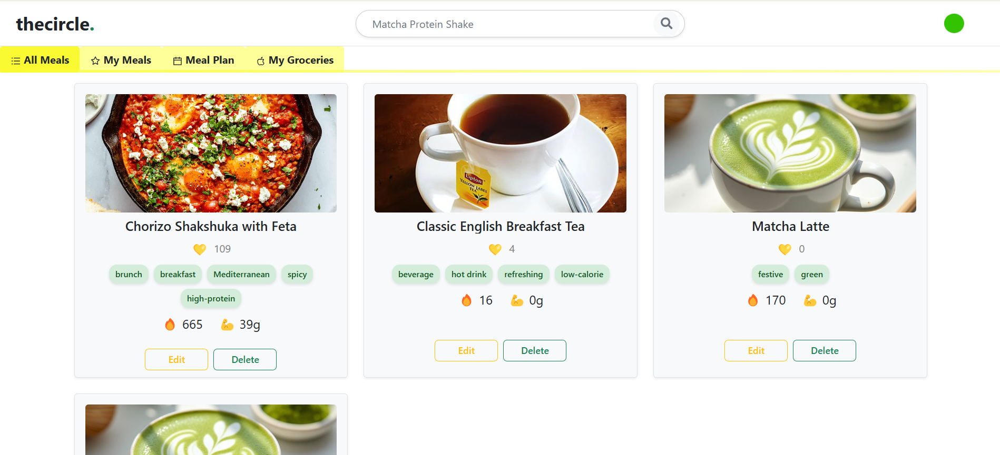

# 🍽️ Meal Planner App

A smart meal planning app where users can:
- Browse public meals
- Save and personalize their own meals
- Plan meals in a drag-and-drop calendar
- Filter meals by tags using a smart tag system

---

## 🖼️ How It Works



The image above illustrates how the app allows users to explore meals and schedule them efficiently with filters and tag-based organization.

---

## ✨ Features

- 🧾 Public & Private Meals
- 🗓️ Calendar-Based Meal Planning
- 🏷️ Smart Tag Filter with Search & Suggest
- ➕ Add-to-Calendar by Date/Time
- 👤 User Role Management (Admin / User)

---

## 🛠️ Tech Stack

- **Frontend:** React, Bootstrap, react-datepicker
- **Backend:** Node.js, Express
- **Database:** MongoDB (Mongoose)

---

## 🚀 Getting Started

```bash
# Install dependencies
npm install

# Start frontend
cd frontend
npm start

# Start backend
cd backend
npm run dev
